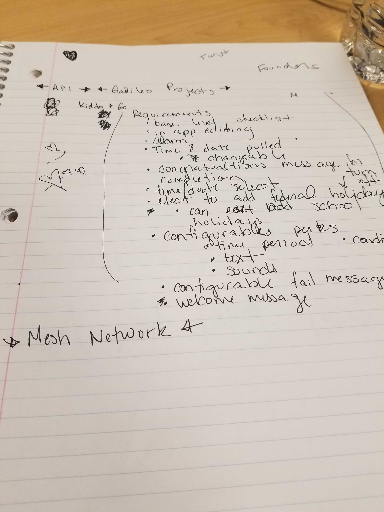
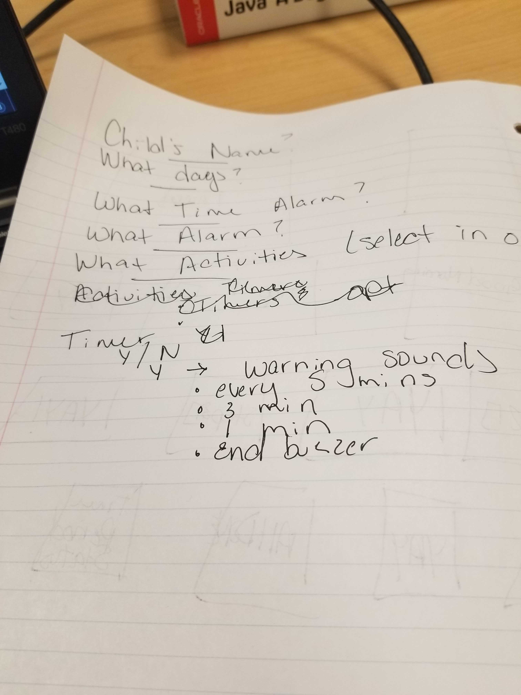
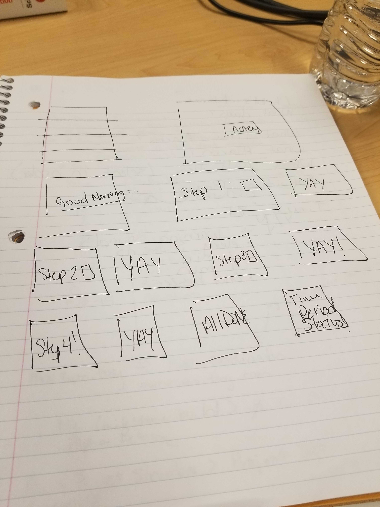
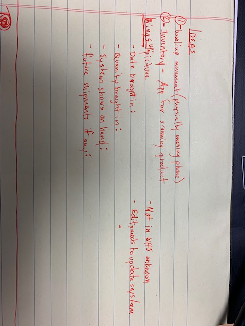

# Personal Android Project Ideas

## Team Members
* Alana Chigbrow
* Jennifer Diaz
* John Bailey
* Anita Martin

## Alana Chigbrow
An app where the parent can set configure a daily checklist of activities childen should complete before going to school, timers, alarms, rewards, and inspirational messages.

### Alana Images

  
  
   

## Jennifer Diaz
External sensors     
Remote to control digital light installation     
arduino/galileo with sensor  

AR App for stemulus   
Website like the one Elizabeth showed in undergrad   
 
## John Bailey
im still completely lost    
ideas: Fitness tracker, Gaming, Alcohol based app   

## Anita Martin

